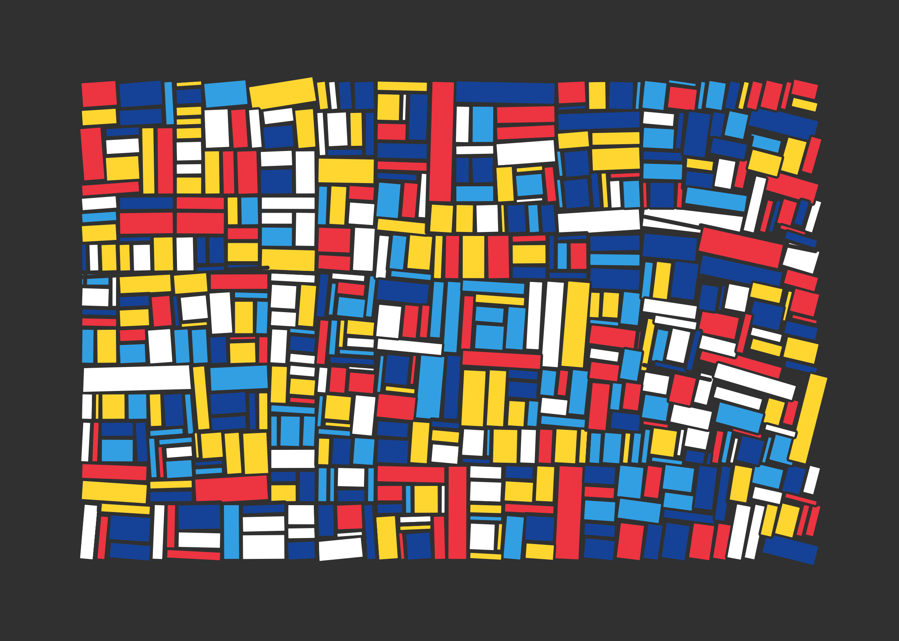
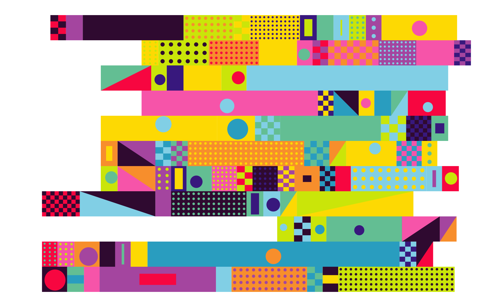
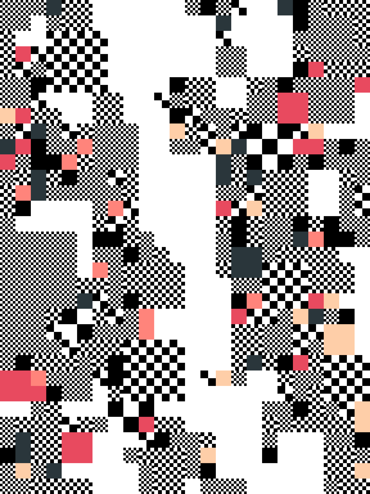
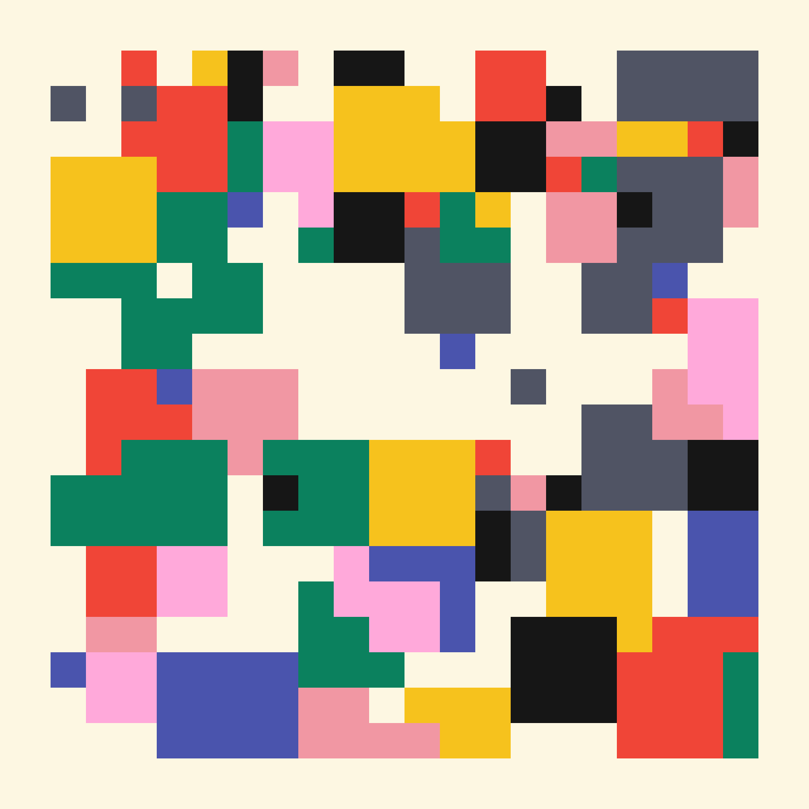
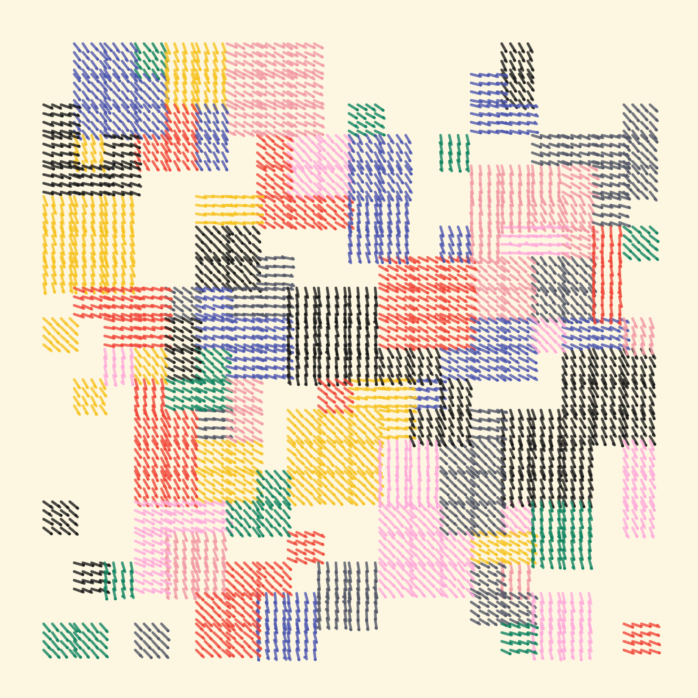

<!-- This file is autogenerated - DO NOT EDIT! -->
# personal p5 sketches

This repo contains a growing number (currently 18) of sketches

| #   | Screenshot                                         | Name                                           | Description                                                 | Reference                                                                     |
| --- | -------------------------------------------------- | ---------------------------------------------- | ----------------------------------------------------------- | ----------------------------------------------------------------------------- |
| 001 |  | [okazz210701a](./src/sketches/okazz210701a.ts) | recreate of okazz210701a                                    | https://openprocessing.org/sketch/1227171                                     |
| 002 |   | [okazz210715](./src/sketches/okazz210715.ts)   | recreate of okazz210715                                     | https://openprocessing.org/sketch/1233942                                     |
| 003 |   | [yifan210719](./src/sketches/yifan210719.ts)   | recreate of Marina Apollonio: rotating dizzy semi-3d widget | http://miriorama.github.io/miriorama-web/#apollonio                           |
| 004 |   | [yifan210720](./src/sketches/yifan210720.ts)   | recreate of Marina Apollonio: neat logo-like design         | https://www.pinterest.ca/pin/562950022148386156/                              |
| 005 |   | [yifan210721](./src/sketches/yifan210721.ts)   | tokyo 2020                                                  | https://openprocessing.org/sketch/1236675/                                    |
| 006 |   | [yifan210722](./src/sketches/yifan210722.ts)   | hay fever                                                   |                                                                               |
| 007 |   | [yifan210723](./src/sketches/yifan210723.ts)   | play with @thi.ng/grid-iterators                            | https://github.com/thi-ng/umbrella/tree/develop/examples/grid-iterators       |
| 008 |   | [yifan210727](./src/sketches/yifan210727.ts)   | recreate of Ringers #0                                      | https://opensea.io/assets/0xa7d8d9ef8d8ce8992df33d8b8cf4aebabd5bd270/13000000 |
| 009 |   | [yifan210729](./src/sketches/yifan210729.ts)   | recreate of Sayama191227                                    | https://openprocessing.org/sketch/816453                                      |
| 010 |   | [yifan210804](./src/sketches/yifan210804.ts)   | stack up!                                                   |                                                                               |
| 011 |   | [yifan210806](./src/sketches/yifan210806.ts)   | dots                                                        |                                                                               |
| 012 |   | [yifan210809](./src/sketches/yifan210809.ts)   | more dots                                                   |                                                                               |
| 013 |   | [yifan210810](./src/sketches/yifan210810.ts)   | blur the line                                               | https://twitter.com/takawo/status/1424730296574889984                         |
| 014 |   | [yifan210812](./src/sketches/yifan210812.ts)   | blur grid                                                   |                                                                               |
| 015 |   | [yifan210905](./src/sketches/yifan210905.ts)   | dice                                                        |                                                                               |
| 016 |   | [yifan221121](./src/sketches/yifan221121.ts)   | recreate Roni Kaufman's work                                | https://twitter.com/KaufmanRoni/status/1589686357102063616                    |
| 017 |   | [yifan230407](./src/sketches/yifan230407.ts)   | recreate Gorilla Sun's work                                 | https://twitter.com/gorillasu/status/1644121608687177728                      |
| 018 |   | [yifan230409](./src/sketches/yifan230409.ts)   | yifan230407 + hatching                                      | https://twitter.com/gorillasu/status/1644121608687177728                      |

