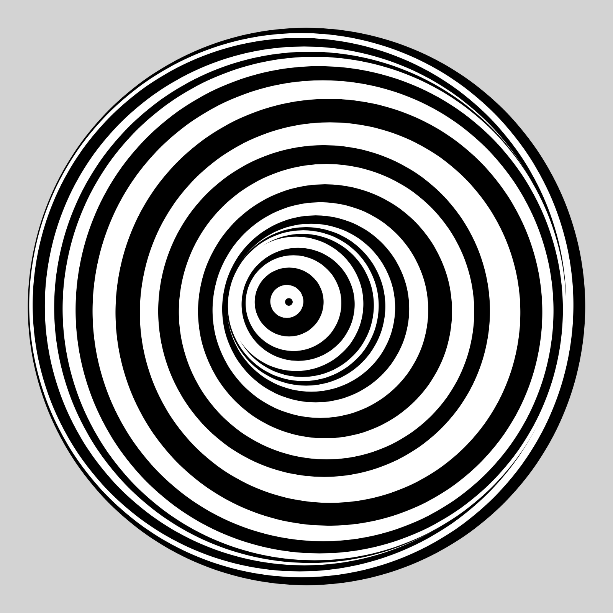
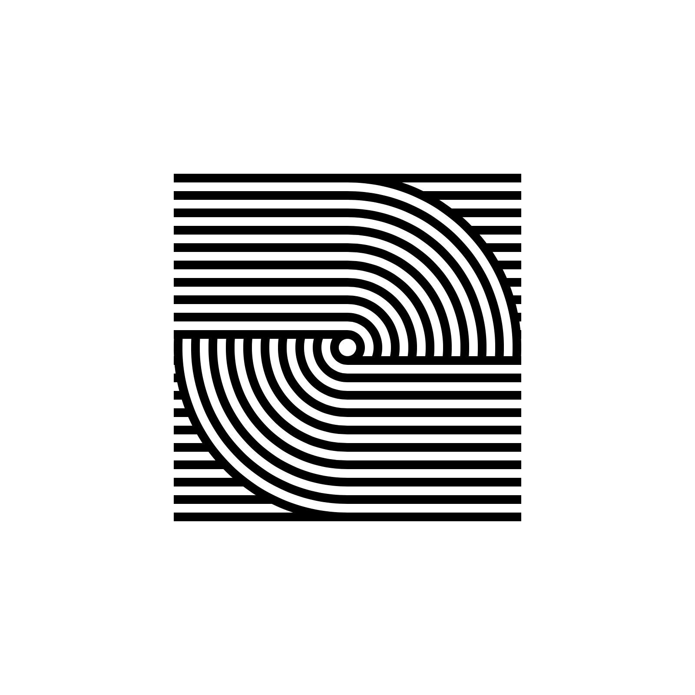
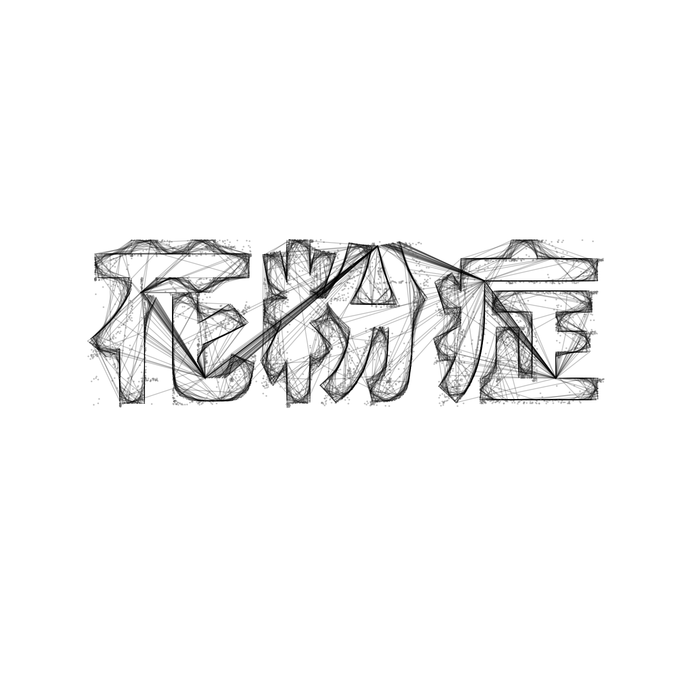
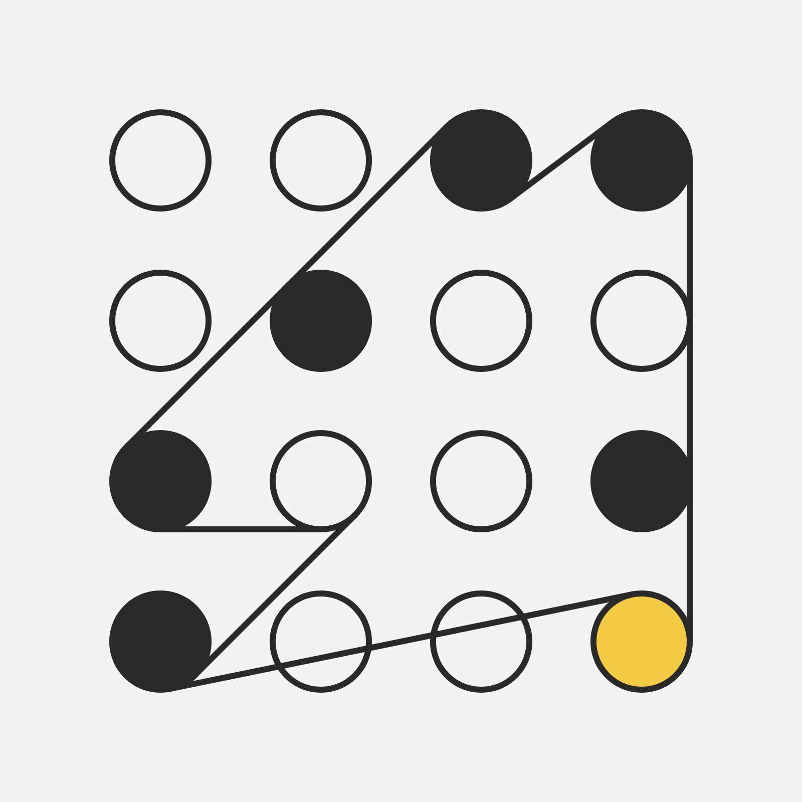
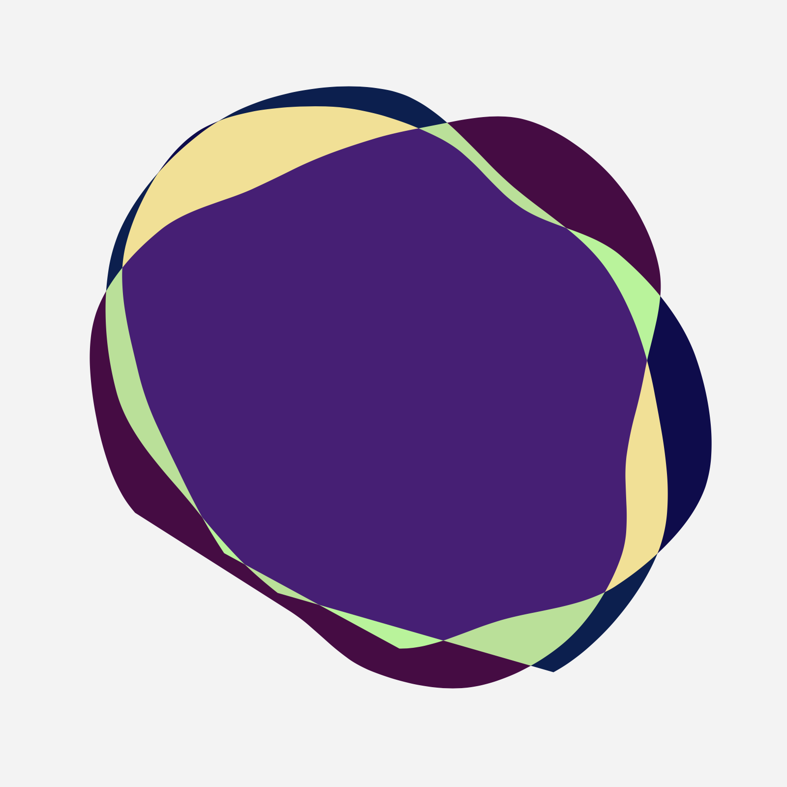
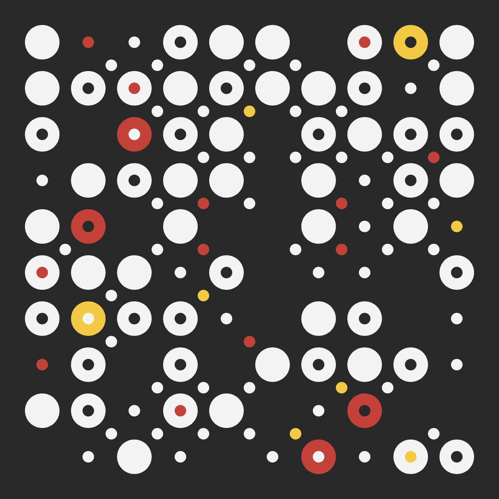
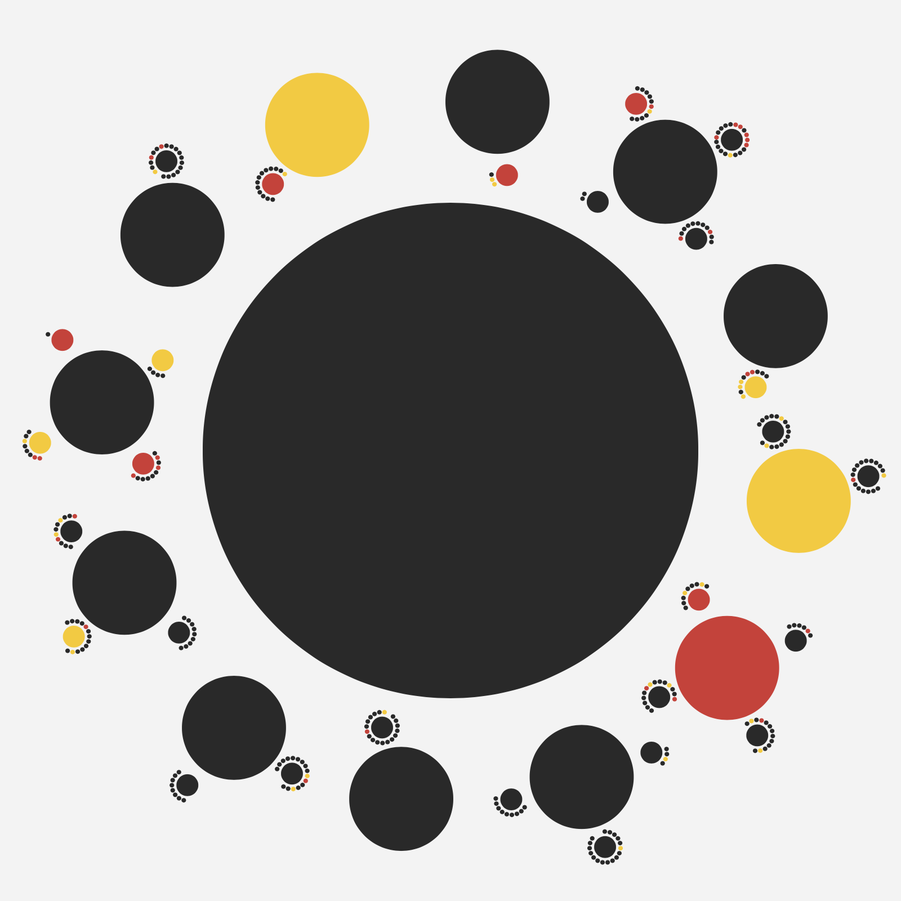
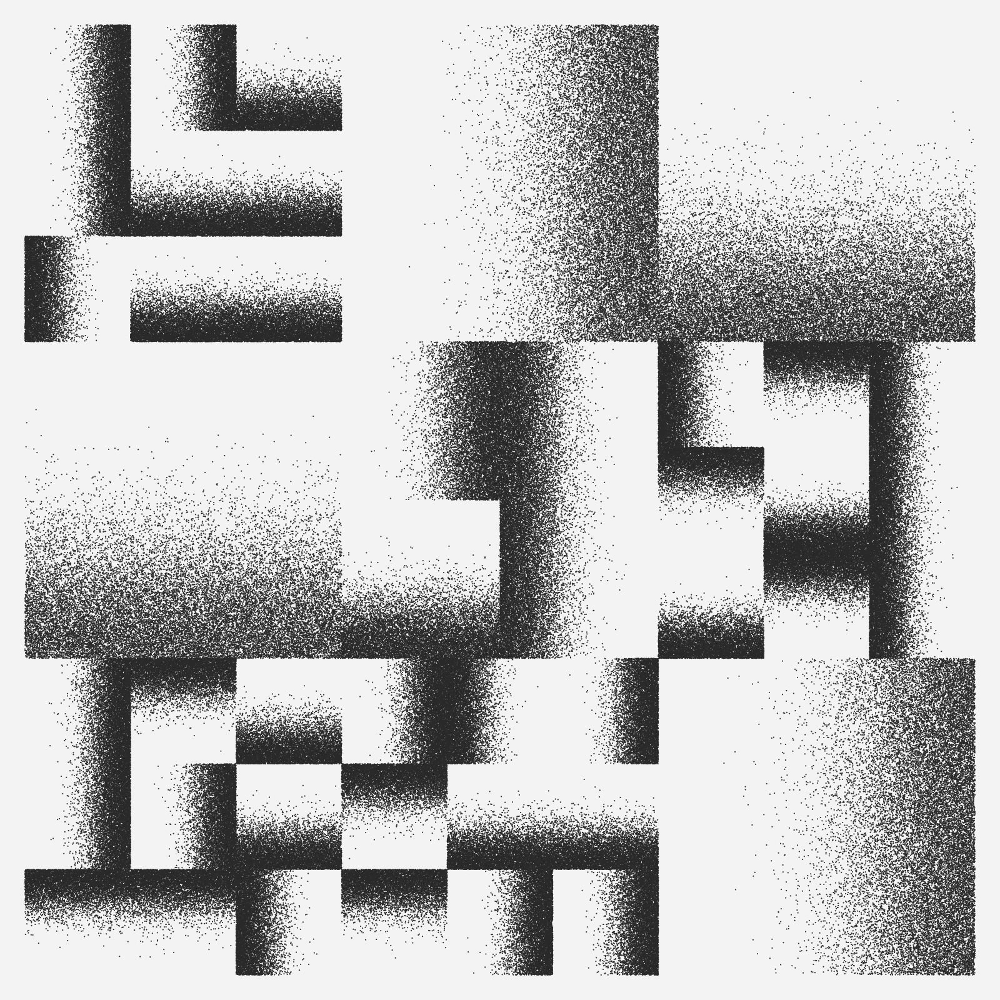
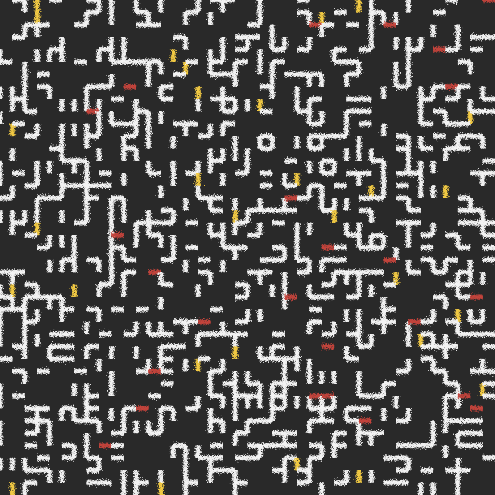
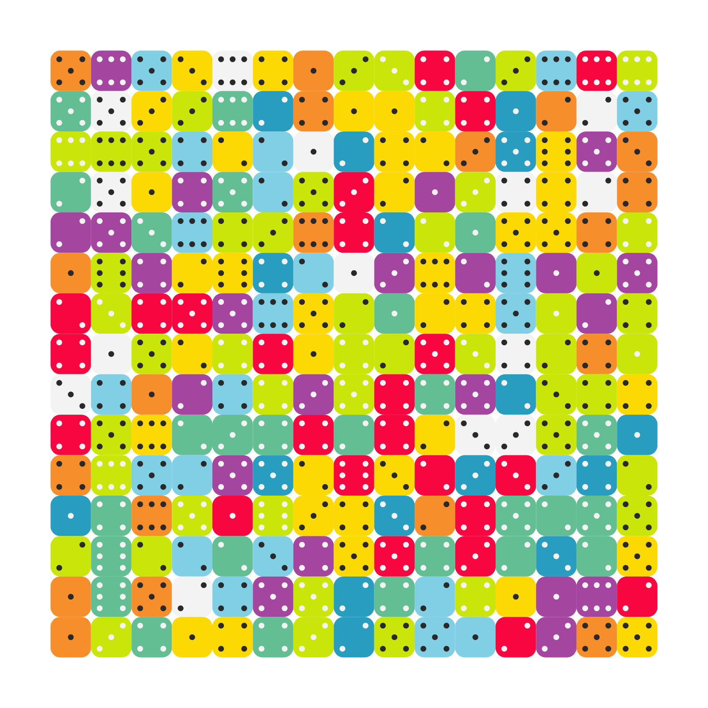

<!-- This file is autogenerated - DO NOT EDIT! -->
# personal p5 sketches

This repo contains a growing number (currently 13) of sketches

| #   | Screenshot                                        | Name                                         | Description                                                 | Reference                                                                     |
| --- | ------------------------------------------------- | -------------------------------------------- | ----------------------------------------------------------- | ----------------------------------------------------------------------------- |
| 001 |  | [yifan210719](./src/sketches/yifan210719.ts) | recreate of Marina Apollonio: rotating dizzy semi-3d widget | http://miriorama.github.io/miriorama-web/#apollonio                           |
| 002 |  | [yifan210720](./src/sketches/yifan210720.ts) | recreate of Marina Apollonio: neat logo-like design         | https://www.pinterest.ca/pin/562950022148386156/                              |
| 003 |  | [yifan210721](./src/sketches/yifan210721.ts) | tokyo 2020                                                  | https://openprocessing.org/sketch/1236675/                                    |
| 004 |  | [yifan210722](./src/sketches/yifan210722.ts) | hay fever                                                   |                                                                               |
| 005 |  | [yifan210723](./src/sketches/yifan210723.ts) | play with @thi.ng/grid-iterators                            | https://github.com/thi-ng/umbrella/tree/develop/examples/grid-iterators       |
| 006 |  | [yifan210727](./src/sketches/yifan210727.ts) | recreate of Ringers #0                                      | https://opensea.io/assets/0xa7d8d9ef8d8ce8992df33d8b8cf4aebabd5bd270/13000000 |
| 007 |  | [yifan210729](./src/sketches/yifan210729.ts) | recreate of Sayama191227                                    | https://openprocessing.org/sketch/816453                                      |
| 008 |  | [yifan210804](./src/sketches/yifan210804.ts) | stack up!                                                   |                                                                               |
| 009 |  | [yifan210806](./src/sketches/yifan210806.ts) | dots                                                        |                                                                               |
| 010 |  | [yifan210809](./src/sketches/yifan210809.ts) | more dots                                                   |                                                                               |
| 011 |  | [yifan210810](./src/sketches/yifan210810.ts) | blur the line                                               | https://twitter.com/takawo/status/1424730296574889984                         |
| 012 |  | [yifan210812](./src/sketches/yifan210812.ts) | blur grid                                                   |                                                                               |
| 013 |  | [yifan210905](./src/sketches/yifan210905.ts) | dice                                                        |                                                                               |

